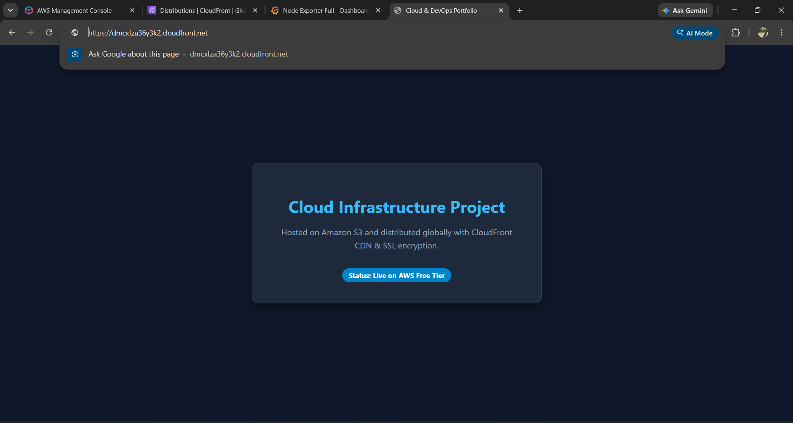
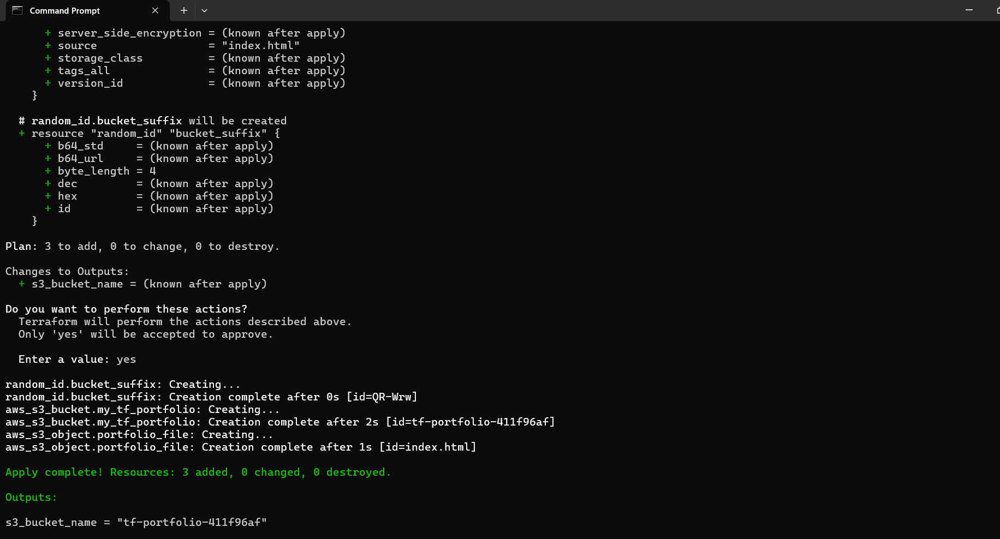
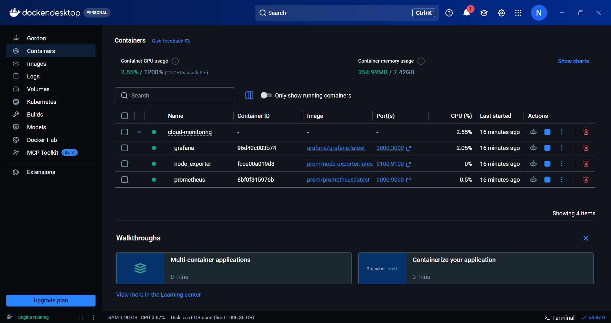
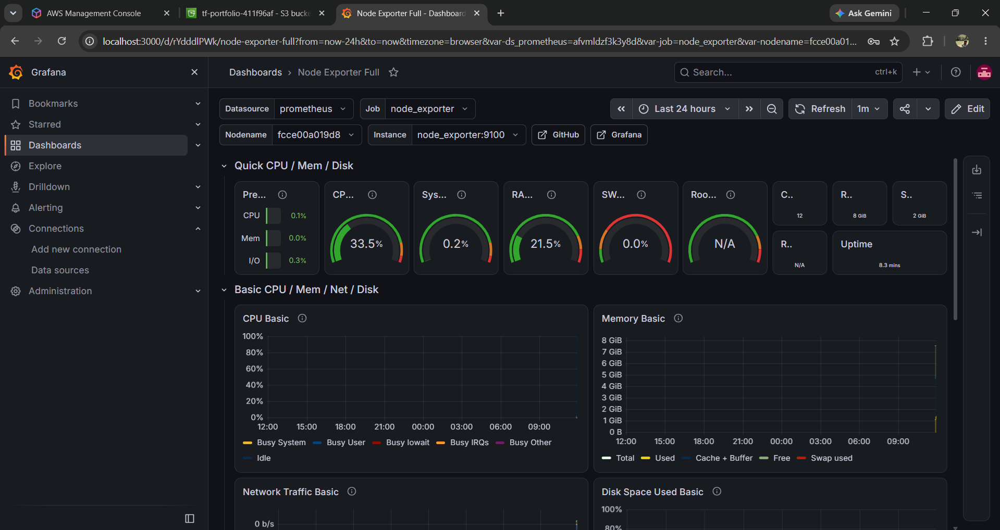

# Multi-Cloud Infrastructure Automation & Observability Pipeline

An end-to-end cloud infrastructure and telemetry project demonstrating Infrastructure as Code (IaC), zero-trust content delivery, containerized microservices, and operational observability.

---

## Architecture Overview

* **Cloud Storage & CDN:** Static assets hosted on Amazon S3 and distributed globally via Amazon CloudFront CDN with SSL/HTTPS encryption and Origin Access Control (OAC).
* **Infrastructure as Code (IaC):** Automated provisioning and resource management using HashiCorp Terraform.
* **Full-Stack Observability:** Telemetry pipeline with Prometheus (metric scraping), Node Exporter (hardware metrics), and Grafana (visualization) deployed via Docker Compose.
* **Cost Governance:** Configured AWS Budgets alerts for zero-spend resource hygiene.

---

## Visual Proof & Dashboards

### 1. Live Distributed Web Endpoint (CloudFront HTTPS)


### 2. Infrastructure as Code Execution (Terraform)


### 3. Containerized Services (Docker Desktop)


### 4. Real-Time Telemetry Dashboard (Grafana)


---

## Repository Structure

```text
├── terraform/
│   ├── main.tf          # Terraform AWS provider and S3 resources
│   └── index.html       # Web asset source
├── monitoring/
│   ├── docker-compose.yml # Container definitions (Prometheus, Grafana, Node Exporter)
│   └── prometheus.yml     # Scrape targets and metric intervals
├── cloudfront-live.png
├── terraform-apply.png
├── docker-containers.png
├── grafana-dashboard.png
└── README.md

How to Reproduce
1. Provision Cloud Infrastructure
Bash
cd terraform
terraform init
terraform plan
terraform apply

2. Launch Local Observability Stack
Bash
cd monitoring
docker compose up -d

Access Grafana: http://localhost:3000 (Default credentials: admin / admin)

Access Prometheus: http://localhost:9090
